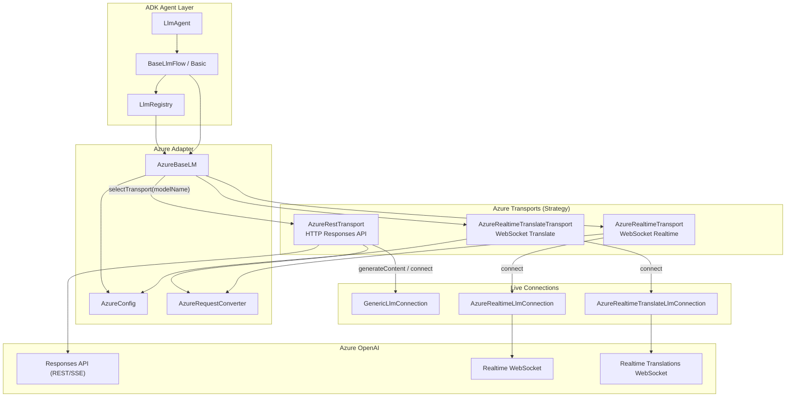
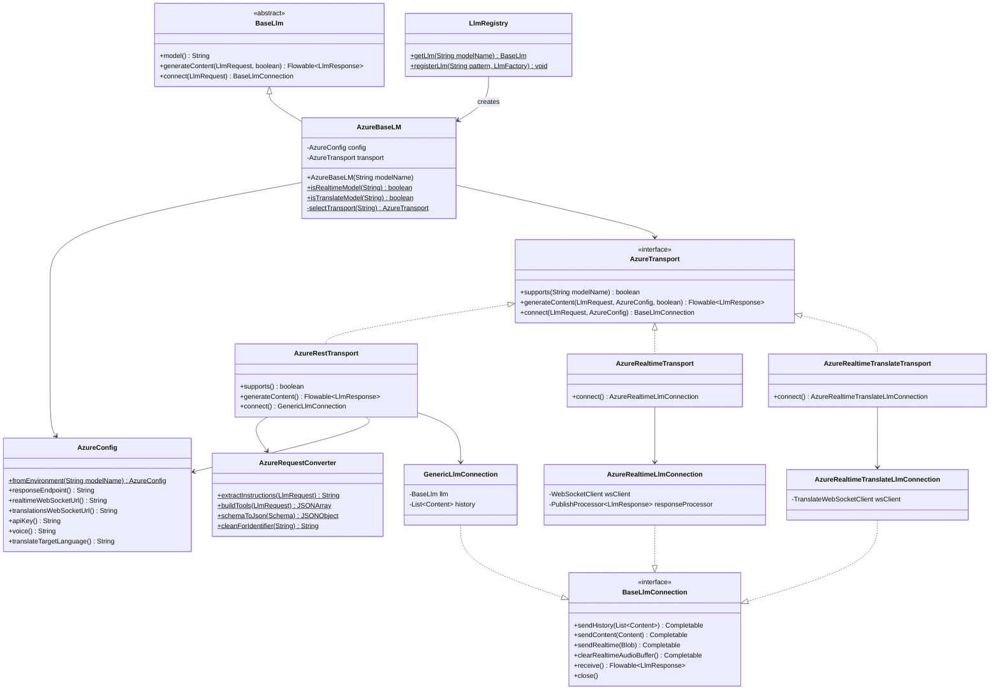
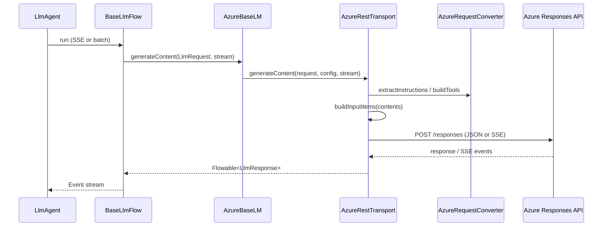
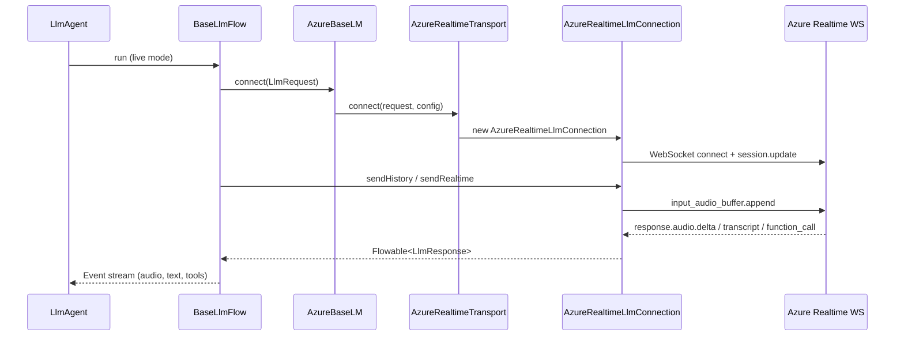

# Azure OpenAI Integration for ADK-Java

This document describes how Azure-hosted models connect to the Agent Development Kit (ADK), how to configure and use them, which API contracts are supported, and how to extend the integration with new Azure API surfaces.

---

## Overview

ADK-Java treats Azure OpenAI as a first-class model provider through a **unified adapter** (`AzureBaseLM`) that delegates to **transport-specific implementations** based on the deployment name. All Azure code lives under:

```
core/src/main/java/com/google/adk/models/
├── AzureBaseLM.java              # Unified entry point (extends BaseLlm)
└── azure/
    ├── AzureConfig.java        # Shared env-based configuration
    ├── AzureTransport.java     # Strategy interface for API contracts
    ├── AzureRequestConverter.java  # ADK → Azure request mapping
    ├── AzureRestTransport.java     # HTTP Responses API
    ├── AzureRealtimeTransport.java # WebSocket voice-agent Realtime API
    ├── AzureRealtimeLlmConnection.java
    ├── AzureRealtimeTranslateTransport.java
    └── AzureRealtimeTranslateLlmConnection.java
```

ADK agents never talk to Azure directly. They use the standard ADK model APIs (`BaseLlm.generateContent`, `BaseLlm.connect`), which are wired through `LlmRegistry` or explicit `Model` instances.

---

## System Architecture

### High-level data flow



### Transport selection logic

`AzureBaseLM` picks a transport automatically from the deployment name:

| Condition on `modelName` | Transport | Protocol |
|---|---|---|
| Contains `realtime-translate` (case-insensitive) | `AzureRealtimeTranslateTransport` | WebSocket `/openai/v1/realtime/translations` |
| Contains `realtime` but **not** `realtime-translate` | `AzureRealtimeTransport` | WebSocket `/openai/v1/realtime` |
| Everything else | `AzureRestTransport` | HTTP Responses API (REST + SSE streaming) |

```java
// AzureBaseLM.selectTransport() — simplified
if (isTranslateModel(modelName))  → AzureRealtimeTranslateTransport
if (isRealtimeModel(modelName))   → AzureRealtimeTransport
else                              → AzureRestTransport
```

---

## Class Diagram



---

## Supported API Contracts

ADK currently supports **three Azure API contracts**, each mapped to a transport:

### 1. Responses API (REST / SSE) — `AzureRestTransport`

**Use for:** Text chat, function calling, reasoning models, batch inference.

| Feature | Support |
|---|---|
| Non-streaming `generateContent` | Yes |
| SSE streaming `generateContent` | Yes |
| Function / tool calling | Yes (via `AzureRequestConverter.buildTools`) |
| System instructions | Yes (from `GenerateContentConfig.systemInstruction`) |
| Temperature / max tokens | Yes |
| Reasoning summary streaming | Yes (emitted as partial text) |
| Live `connect()` | Yes (via `GenericLlmConnection` — HTTP round-trip per turn) |
| Real-time audio | No |

**Endpoint env var:** `AZURE_RESPONSE_ENDPOINT`

**Example endpoint:**
```
https://<resource>.openai.azure.com/openai/v1/responses
```

**Typical deployment names:** Any name that does **not** contain `realtime`, e.g. `gpt-4o`, `gpt-5`, `o3-mini`, `gpt5pro`.

---

### 2. Realtime Voice Agent API — `AzureRealtimeTransport`

**Use for:** Bidirectional voice agents with VAD, barge-in, tool calling, and audio output.

| Feature | Support |
|---|---|
| `connect()` + live session | Yes (primary mode) |
| `sendRealtime(Blob)` — PCM16 audio in | Yes |
| `clearRealtimeAudioBuffer()` | Yes |
| `sendContent()` — text / function responses | Yes |
| `sendHistory()` | Yes |
| Audio output (PCM16) | Yes (as `Blob` in `LlmResponse`) |
| Input transcription | Yes (Whisper, as `inputTranscription`) |
| Function calling | Yes |
| Barge-in / interrupted signal | Yes (`LlmResponse.interrupted`) |
| Turn completion | Yes (`LlmResponse.turnComplete`) |
| `generateContent()` | Fallback only (short-lived WebSocket) |

**Endpoint env var:** `AZURE_REALTIME_ENDPOINT`

**Example endpoint:**
```
https://<resource>.openai.azure.com/openai/v1/realtime
```

**Typical deployment names:** Names containing `realtime` but not `realtime-translate`, e.g. `gpt-4o-realtime-preview`, `gpt-realtime`.

**Optional env vars:**
- `AZURE_REALTIME_VOICE` — voice name (default: `alloy`)

---

### 3. GPT Realtime Translate — `AzureRealtimeTranslateTransport`

**Use for:** Continuous speech translation (source audio in → translated audio + transcript out).

| Feature | Support |
|---|---|
| `connect()` + live session | Yes (required) |
| `sendRealtime(Blob)` — source audio | Yes |
| Translated audio output | Yes |
| Output transcript deltas | Yes |
| Input transcript deltas | Yes (`inputTranscription`) |
| Target language config | Yes (`AZURE_TRANSLATE_TARGET_LANGUAGE`) |
| Agent turn / function calling | No |
| `generateContent()` | Not supported (throws) |

**Endpoint env var:** `AZURE_TRANSLATE_ENDPOINT`

**Example endpoint (GA format):**
```
wss://<resource>.openai.azure.com/openai/v1/realtime/translations?model=<deployment>
```

**Typical deployment names:** Names containing `realtime-translate`, e.g. `gpt-realtime-translate`.

**Optional env vars:**
- `AZURE_TRANSLATE_TARGET_LANGUAGE` — ISO language code (default: `en`)

> **Note:** ADK normalizes translate URLs to the GA shape (`/openai/v1/realtime/translations?model=`) and strips legacy `api-version` query params that cause HTTP 400.

---

## Configuration

### Environment variables

| Variable | Required | Used by | Description |
|---|---|---|---|
| `AZURE_OPENAI_API_KEY` | **Yes** | All transports | API key sent as `api-key` header |
| `AZURE_RESPONSE_ENDPOINT` | For REST | `AzureRestTransport` | HTTP Responses API URL |
| `AZURE_REALTIME_ENDPOINT` | For Realtime | `AzureRealtimeTransport` | Realtime WebSocket base URL |
| `AZURE_TRANSLATE_ENDPOINT` | For Translate | `AzureRealtimeTranslateTransport` | Translate WebSocket URL |
| `AZURE_REALTIME_VOICE` | No | Realtime | Voice (default: `alloy`) |
| `AZURE_TRANSLATE_TARGET_LANGUAGE` | No | Translate | Target language (default: `en`) |

### Example `.env` / shell setup

```bash
# Required
export AZURE_OPENAI_API_KEY="your-api-key"

# REST chat / tools
export AZURE_RESPONSE_ENDPOINT="https://my-resource.openai.azure.com/openai/v1/responses"

# Voice agent
export AZURE_REALTIME_ENDPOINT="https://my-resource.openai.azure.com/openai/v1/realtime"
export AZURE_REALTIME_VOICE="alloy"

# Speech translation
export AZURE_TRANSLATE_ENDPOINT="https://my-resource.openai.azure.com/openai/v1/realtime/translations"
export AZURE_TRANSLATE_TARGET_LANGUAGE="hi"
```

---

## How Azure Connects to ADK

### Registration via `LlmRegistry`

Azure models are resolved through `LlmRegistry`, the central factory for all LLM providers. Two patterns match Azure deployments:

```java
// Pattern 1: Explicit Azure prefix (recommended)
// Model name: "Azure|<deployment-name>"
registerLlm("Azure\\|.*", modelName -> {
  String actualModel = modelName.split("\\|", 2)[1];
  return new AzureBaseLM(actualModel);
});

// Pattern 2: Any model name containing "realtime"
registerLlm(".*realtime.*", modelName -> {
  String actualModel = modelName.contains("|")
      ? modelName.split("\\|", 2)[1]
      : modelName;
  return new AzureBaseLM(actualModel);
});
```

At runtime, `LlmAgent` resolves the model via `LlmRegistry.getLlm(modelName)` (see `LlmAgent.resolveModelInternal()`), and `BaseLlmFlow` calls `generateContent` or `connect` on the resolved `BaseLlm`.

### Request lifecycle (REST)



### Request lifecycle (Realtime voice)



---

## Usage Guide

### 1. REST chat agent (Responses API)

```java
import com.google.adk.agents.LlmAgent;
import com.google.adk.models.Model;

LlmAgent agent = LlmAgent.builder()
    .name("azure-chat-agent")
    .model(Model.builder().modelName("Azure|gpt-4o").build())
    .instruction("You are a helpful assistant.")
    .build();
```

Or instantiate the LLM directly:

```java
import com.google.adk.models.AzureBaseLM;
import com.google.adk.models.LlmRequest;
import com.google.adk.models.LlmResponse;
import com.google.genai.types.Content;
import com.google.genai.types.Part;

AzureBaseLM llm = new AzureBaseLM("gpt-4o");

LlmRequest request = LlmRequest.builder()
    .contents(Content.fromParts(Part.fromText("Explain quantum computing briefly.")))
    .build();

llm.generateContent(request, false)  // false = non-streaming
    .blockingForEach(response -> {
      response.content().ifPresent(c ->
          c.parts().ifPresent(parts ->
              parts.forEach(p -> p.text().ifPresent(System.out::println))));
    });
```

### 2. Streaming REST

```java
llm.generateContent(request, true)  // true = SSE streaming
    .subscribe(
        response -> { /* handle partial LlmResponse */ },
        error -> { /* handle error */ },
        () -> { /* stream complete */ });
```

### 3. Function calling (tools)

Define tools on the agent as usual. ADK converts them to Azure function schemas via `AzureRequestConverter.buildTools()`:

```java
LlmAgent agent = LlmAgent.builder()
    .name("azure-tools-agent")
    .model(Model.builder().modelName("Azure|gpt-4o").build())
    .tools(myTool)
    .build();
```

The REST transport maps ADK `FunctionCall` / `FunctionResponse` parts to Azure Responses API `function_call` and `function_call_output` items.

### 4. Realtime voice agent

Set the model to a Realtime deployment and run the agent in live mode (ADK handles `connect()`, `sendRealtime`, and `receive()` via `BaseLlmFlow`):

```java
LlmAgent voiceAgent = LlmAgent.builder()
    .name("azure-voice-agent")
    .model(Model.builder().modelName("Azure|gpt-4o-realtime-preview").build())
    .instruction("You are a voice assistant.")
    .tools(searchTool)
    .build();
```

Ensure `AZURE_REALTIME_ENDPOINT` and `AZURE_OPENAI_API_KEY` are set. Audio is PCM16 (`audio/pcm` MIME type).

Direct connection API (without full agent flow):

```java
AzureBaseLM llm = new AzureBaseLM("gpt-4o-realtime-preview");
BaseLlmConnection conn = llm.connect(LlmRequest.builder().build());

conn.receive().subscribe(response -> { /* audio blobs, transcripts, tool calls */ });

// Send PCM16 audio chunks
conn.sendRealtime(Blob.builder()
    .mimeType("audio/pcm")
    .data(pcmBytes)
    .build()).blockingAwait();

conn.close();
```

### 5. Realtime translation

```java
AzureBaseLM translateLlm = new AzureBaseLM("gpt-realtime-translate");
BaseLlmConnection conn = translateLlm.connect(LlmRequest.builder().build());

conn.receive().subscribe(response -> {
  // Translated audio: response.content() → Part.inlineData (audio/pcm)
  // Translated text:   response.content() → Part.text (partial deltas)
  // Source text:       response.inputTranscription()
});

conn.sendRealtime(sourceAudioBlob).blockingAwait();
```

Override target language programmatically:

```java
// AzureConfig supports withTranslateTargetLanguage() if you construct config manually
```

---

## Supported Models (Deployment Names)

ADK does not hard-code a model catalog. It routes by **deployment name pattern** and **Azure endpoint**. Any deployment hosted on your Azure resource works as long as the API contract matches.

| Category | Name pattern | Azure API | Example deployment names |
|---|---|---|---|
| Chat / reasoning / tools | No `realtime` in name | Responses API | `gpt-4o`, `gpt-4.1`, `gpt-5`, `gpt5pro`, `o3-mini`, `o4-mini` |
| Voice agent | Contains `realtime`, not `realtime-translate` | Realtime WebSocket | `gpt-4o-realtime-preview`, `gpt-realtime` |
| Speech translation | Contains `realtime-translate` | Realtime Translations | `gpt-realtime-translate` |

The string passed to `AzureBaseLM` or after the `Azure|` prefix must match your **Azure deployment name**, not necessarily the base model ID.

---

## ADK ↔ Azure Request Mapping

`AzureRequestConverter` is the shared conversion layer used by all transports:

| ADK concept | Azure / OpenAI field |
|---|---|
| `GenerateContentConfig.systemInstruction` | `instructions` (REST) or `session.instructions` (Realtime) |
| `LlmRequest.tools` | `tools[]` with `type: function` |
| `Schema` (tool parameters) | JSON Schema object |
| `Content` with text parts | `input[]` messages (REST) or `conversation.item.create` (Realtime) |
| `FunctionCall` part | `function_call` item |
| `FunctionResponse` part | `function_call_output` item |
| `GenerateContentConfig.temperature` | `temperature` |
| `GenerateContentConfig.maxOutputTokens` | `max_output_tokens` |

Tool names are sanitized via `cleanForIdentifier()` to match Azure's allowed character set `[a-zA-Z0-9_.-]`.

---

## Adding a New Azure API Contract

To add support for another Azure API surface (e.g. Chat Completions, Embeddings, a new Realtime variant):

### Step 1 — Add configuration

Extend `AzureConfig` with a new endpoint environment variable and accessor:

```java
public static final String EMBEDDINGS_ENDPOINT_ENV = "AZURE_EMBEDDINGS_ENDPOINT";

public String embeddingsEndpoint() {
  return embeddingsEndpoint;
}
```

Resolve it in `fromEnvironment()` using the same `resolveContractEndpoint()` helper pattern.

### Step 2 — Create a transport

Implement `AzureTransport`:

```java
public final class AzureEmbeddingsTransport implements AzureTransport {

  @Override
  public boolean supports(String modelName) {
    return modelName != null && modelName.toLowerCase().contains("embedding");
  }

  @Override
  public Flowable<LlmResponse> generateContent(
      LlmRequest request, AzureConfig config, boolean stream) {
    // Call Azure Embeddings API, map result to LlmResponse
  }

  @Override
  public BaseLlmConnection connect(LlmRequest request, AzureConfig config) {
    throw new UnsupportedOperationException("Embeddings does not support live connections");
  }
}
```

Reuse `AzureRequestConverter` wherever ADK types need conversion.

### Step 3 — Wire transport selection

Update `AzureBaseLM.selectTransport()`:

```java
private static AzureTransport selectTransport(String modelName) {
  if (isTranslateModel(modelName)) return new AzureRealtimeTranslateTransport();
  if (isRealtimeModel(modelName))     return new AzureRealtimeTransport();
  if (isEmbeddingModel(modelName))    return new AzureEmbeddingsTransport();  // new
  return new AzureRestTransport();
}
```

Add a public static detection helper alongside `isRealtimeModel()` / `isTranslateModel()`.

### Step 4 — (Optional) Add a live connection class

If the new contract uses WebSocket or another persistent protocol, implement `BaseLlmConnection` in the `azure` subpackage (follow `AzureRealtimeLlmConnection` as a reference):

- Open connection in constructor
- Map protocol events → `LlmResponse` via `PublishProcessor`
- Implement `sendHistory`, `sendContent`, `sendRealtime` as appropriate
- Handle barge-in, errors, and cleanup in `close()`

Return the connection from your transport's `connect()` method.

### Step 5 — Register in `LlmRegistry` (if needed)

If the new contract uses a distinct model name pattern, register a factory:

```java
LlmRegistry.registerLlm("Azure\\|.*embedding.*", name -> new AzureBaseLM(name.split("\\|", 2)[1]));
```

Existing `Azure|*` and `.*realtime.*` patterns already route to `AzureBaseLM` for most cases.

### Step 6 — Document and test

- Add env var docs to this file
- Add unit tests for URL normalization, request conversion, and response parsing
- Add an integration test gated on env vars (see existing patterns in `contrib/spring-ai`)

### Design principles to follow

1. **One transport per API contract** — do not mix REST and WebSocket logic in the same class.
2. **Shared config in `AzureConfig`** — never read env vars directly from transports.
3. **Shared conversion in `AzureRequestConverter`** — avoid duplicating tool/instruction mapping.
4. **Return ADK types** — all transports must emit `LlmResponse` / `BaseLlmConnection`, never leak raw Azure JSON to agent code.
5. **Keep `AzureBaseLM` thin** — it should only select transport and delegate.

---

## Package Reference

| Class | Responsibility |
|---|---|
| `AzureBaseLM` | Unified `BaseLlm` entry point; transport selection |
| `AzureConfig` | Env-based endpoints, API key, voice, translate language |
| `AzureTransport` | Strategy interface for API contracts |
| `AzureRequestConverter` | ADK `LlmRequest` → Azure JSON (instructions, tools, schemas) |
| `AzureRestTransport` | HTTP Responses API (sync + SSE streaming) |
| `AzureRealtimeTransport` | Realtime WebSocket transport wrapper |
| `AzureRealtimeLlmConnection` | Full Realtime protocol (audio, VAD, tools, barge-in) |
| `AzureRealtimeTranslateTransport` | Translate WebSocket transport wrapper |
| `AzureRealtimeTranslateLlmConnection` | Translation session protocol |
| `GenericLlmConnection` | HTTP-based pseudo-connection used by REST transport |
| `LlmRegistry` | Factory/registry that creates `AzureBaseLM` instances |
| `BaseLlmFlow` | Agent flow that calls `generateContent` or `connect` |

---

## Troubleshooting

| Symptom | Likely cause | Fix |
|---|---|---|
| `AZURE_OPENAI_API_KEY environment variable is not set` | Missing API key | Set `AZURE_OPENAI_API_KEY` |
| `Azure Responses API endpoint not configured` | Missing REST endpoint | Set `AZURE_RESPONSE_ENDPOINT` |
| Translate returns HTTP 400 | Legacy preview URL with `api-version` | Use GA URL: `/openai/v1/realtime/translations?model=<deployment>` |
| `Unsupported model: ...` | Name doesn't match any `LlmRegistry` pattern | Use `Azure\|<deployment>` or register a custom pattern |
| Realtime connects but no audio | Wrong MIME type | Send PCM16 as `audio/pcm` |
| Function calls missing name on Realtime | API version omits fields on `function_call_arguments.done` | Already handled via `pendingFunctionCalls` map in `AzureRealtimeLlmConnection` |
| Voice agent gets empty REST response | Realtime deployment used with REST endpoint | Use `AZURE_REALTIME_ENDPOINT` and a `realtime` deployment name |

---

## Related Documentation

- [Azure OpenAI Responses API](https://learn.microsoft.com/en-us/azure/ai-foundry/openai/how-to/responses)
- [Azure OpenAI Realtime Audio WebSockets](https://learn.microsoft.com/en-us/azure/foundry/openai/how-to/realtime-audio-websockets)
- [GPT Realtime Translate overview](https://learn.microsoft.com/en-us/azure/foundry/openai/concepts/gpt-realtime-translate)
- ADK transcription capability: [`TRANSCRIPTION_CAPABILITY.md`](TRANSCRIPTION_CAPABILITY.md)
- Spring AI bridge (alternative Azure path): [`contrib/spring-ai/README.md`](contrib/spring-ai/README.md)

---

## Quick Reference

```bash
# Minimal REST setup
export AZURE_OPENAI_API_KEY="..."
export AZURE_RESPONSE_ENDPOINT="https://<resource>.openai.azure.com/openai/v1/responses"
```

```java
// Minimal agent
LlmAgent.builder()
    .name("my-agent")
    .model(Model.builder().modelName("Azure|my-deployment").build())
    .build();
```

```java
// Direct LLM access
BaseLlm llm = new AzureBaseLM("my-deployment");
llm.generateContent(request, stream).subscribe(...);
```
