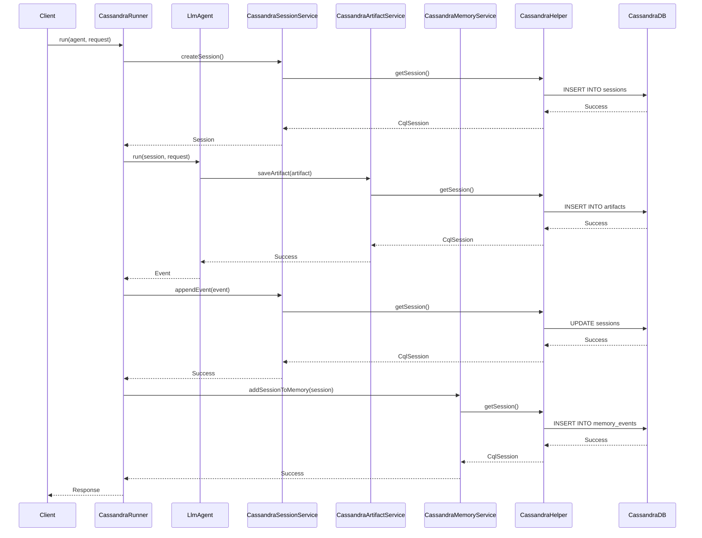

# Cassandra Implementation

**Author:** Sandeep Belgavi
**Date:** October 2, 2025

## Overview

This document outlines the Cassandra-backed implementation for core services within the Google Agent Development Kit (ADK). These services provide a persistent storage layer for sessions, artifacts, and memory, using Apache Cassandra.

## Features Implemented

The following services have been implemented to use a Cassandra backend:

### 1. `CassandraSessionService`
Located in `com.google.adk.sessions`, this service manages the lifecycle of agent sessions.

- **`createSession`**: Creates a new session and stores it in the `sessions` table.
- **`getSession`**: Retrieves a specific session by its ID.
- **`listSessions`**: Lists all sessions for a given user and application.
- **`deleteSession`**: Deletes a session from the database.
- **`appendEvent`**: Appends a new event to a session's event list and updates the session in the database.

### 2. `CassandraArtifactService`
Located in `com.google.adk.artifacts`, this service handles the storage and retrieval of artifacts associated with a session.

- **`saveArtifact`**: Saves a new artifact (e.g., a file) and assigns it a version number.
- **`loadArtifact`**: Loads a specific version of an artifact, or the latest version if not specified.
- **`listArtifactKeys`**: Lists the filenames of all artifacts for a given session.
- **`deleteArtifact`**: Deletes all versions of a specific artifact.
- **`listVersions`**: Lists all available version numbers for a given artifact.

**Note on Binary Data:** To store binary files (e.g., images, audio), you should read the file into a `byte[]` and create a `Part` using `Part.fromData(bytes, mimeType)`. The service will automatically serialize the `Part` object (with the binary data Base64 encoded within the JSON structure) and store it in a `BLOB` field for efficient retrieval.

### 3. `CassandraMemoryService`
Located in `com.google.adk.memory`, this service provides a simple keyword-based memory search for agents.

- **`addSessionToMemory`**: Indexes the events of a session, storing them in the `memory_events` table and updating the `memory_inverted_index` for searching.
- **`searchMemory`**: Searches the memory for events that contain keywords from a given query.

### 4. `CassandraRunner`
Located in `com.google.adk.runner`, this is a new runner class that initializes and uses the Cassandra-backed services. It is configured to connect to a local Cassandra instance by default.

## Cassandra Table Statements

The following CQL statements are used to create the necessary keyspace and tables in Cassandra. These are executed automatically by the `CassandraHelper` class upon initialization.

```cql
CREATE KEYSPACE IF NOT EXISTS adk WITH replication = {'class': 'SimpleStrategy', 'replication_factor': 1};

USE adk;

CREATE TABLE IF NOT EXISTS sessions (
    app_name TEXT,
    user_id TEXT,
    session_id TEXT,
    session_data TEXT,
    PRIMARY KEY ((app_name, user_id), session_id)
);

CREATE TABLE IF NOT EXISTS user_state (
    app_name TEXT,
    user_id TEXT,
    state_key TEXT,
    state_value TEXT,
    PRIMARY KEY ((app_name, user_id), state_key)
);

CREATE TABLE IF NOT EXISTS app_state (
    app_name TEXT,
    state_key TEXT,
    state_value TEXT,
    PRIMARY KEY (app_name, state_key)
);

CREATE TABLE IF NOT EXISTS artifacts (
    app_name TEXT,
    user_id TEXT,
    session_id TEXT,
    filename TEXT,
    version INT,
    artifact_data BLOB,
    PRIMARY KEY ((app_name, user_id, session_id), filename, version)
);

CREATE TABLE IF NOT EXISTS memory_events (
    app_name TEXT,
    user_id TEXT,
    event_id TIMEUUID,
    event_data TEXT,
    PRIMARY KEY ((app_name, user_id), event_id)
);

CREATE TABLE IF NOT EXISTS memory_inverted_index (
    app_name TEXT,
    user_id TEXT,
    word TEXT,
    event_ids SET<TIMEUUID>,
    PRIMARY KEY ((app_name, user_id), word)
);
```

## Sample Main Programs

The following are sample `main` methods that demonstrate how to use each of the new Cassandra-backed services.

**Note:** To run these examples, you will need to have a Cassandra instance running locally and have the necessary dependencies in your project.

### `CassandraSessionService` Example

```java
import com.datastax.oss.driver.api.core.CqlSession;
import com.datastax.oss.driver.api.core.CqlSessionBuilder;
import com.google.adk.sessions.CassandraSessionService;
import com.google.adk.sessions.Session;
import com.google.adk.store.CassandraHelper;
import java.net.InetSocketAddress;
import java.util.Optional;

public class CassandraSessionServiceExample {
    public static void main(String[] args) {
        CqlSessionBuilder sessionBuilder = CqlSession.builder()
            .addContactPoint(new InetSocketAddress("127.0.0.1", 9042))
            .withLocalDatacenter("datacenter1");
        CassandraHelper.initialize(sessionBuilder);

        CassandraSessionService sessionService = new CassandraSessionService();

        String appName = "myApp";
        String userId = "user123";

        // Create a session
        Session createdSession = sessionService.createSession(appName, userId, null, null).blockingGet();
        System.out.println("Created session: " + createdSession.id());

        // Get the session
        Session retrievedSession = sessionService.getSession(appName, userId, createdSession.id(), Optional.empty()).blockingGet();
        System.out.println("Retrieved session: " + retrievedSession.id());

        CassandraHelper.close();
    }
}
```

### `CassandraArtifactService` Example

```java
import com.datastax.oss.driver.api.core.CqlSession;
import com.datastax.oss.driver.api.core.CqlSessionBuilder;
import com.google.adk.artifacts.CassandraArtifactService;
import com.google.adk.store.CassandraHelper;
import com.google.genai.types.Part;
import java.net.InetSocketAddress;
import java.nio.file.Files;
import java.nio.file.Paths;
import java.util.Optional;

public class CassandraArtifactServiceExample {
    public static void main(String[] args) throws Exception {
        CqlSessionBuilder sessionBuilder = CqlSession.builder()
            .addContactPoint(new InetSocketAddress("127.0.0.1", 9042))
            .withLocalDatacenter("datacenter1");
        CassandraHelper.initialize(sessionBuilder);

        CassandraArtifactService artifactService = new CassandraArtifactService();

        String appName = "myApp";
        String userId = "user123";
        String sessionId = "session456";
        
        // Example with a text file
        String textFilename = "greeting.txt";
        Part textArtifact = Part.fromText("Hello, world!");
        Integer textVersion = artifactService.saveArtifact(appName, userId, sessionId, textFilename, textArtifact).blockingGet();
        System.out.println("Saved text artifact '" + textFilename + "' with version: " + textVersion);
        Part loadedTextArtifact = artifactService.loadArtifact(appName, userId, sessionId, textFilename, Optional.of(textVersion)).blockingGet();
        System.out.println("Loaded text artifact content: " + loadedTextArtifact.text().get());

        // Example with a binary file (e.g., an image)
        String binaryFilename = "my-image.png";
        // Create a dummy file for the example
        Files.write(Paths.get(binaryFilename), new byte[]{1, 2, 3, 4, 5});
        byte[] binaryData = Files.readAllBytes(Paths.get(binaryFilename));
        Part binaryArtifact = Part.fromBytes(binaryData, "image/png");
        Integer binaryVersion = artifactService.saveArtifact(appName, userId, sessionId, binaryFilename, binaryArtifact).blockingGet();
        System.out.println("Saved binary artifact '" + binaryFilename + "' with version: " + binaryVersion);
        Part loadedBinaryArtifact = artifactService.loadArtifact(appName, userId, sessionId, binaryFilename, Optional.of(binaryVersion)).blockingGet();
        System.out.println("Loaded binary artifact content has " + loadedBinaryArtifact.inlineData().get().data().get().length + " bytes.");

        CassandraHelper.close();
    }
}
```

### `CassandraMemoryService` Example

```java
import com.datastax.oss.driver.api.core.CqlSession;
import com.datastax.oss.driver.api.core.CqlSessionBuilder;
import com.google.adk.events.Event;
import com.google.adk.memory.CassandraMemoryService;
import com.google.adk.memory.SearchMemoryResponse;
import com.google.adk.sessions.Session;
import com.google.adk.store.CassandraHelper;
import com.google.genai.types.Content;
import com.google.genai.types.Part;
import java.net.InetSocketAddress;
import java.util.List;

public class CassandraMemoryServiceExample {
    public static void main(String[] args) {
        CqlSessionBuilder sessionBuilder = CqlSession.builder()
            .addContactPoint(new InetSocketAddress("127.0.0.1", 9042))
            .withLocalDatacenter("datacenter1");
        CassandraHelper.initialize(sessionBuilder);

        CassandraMemoryService memoryService = new CassandraMemoryService();

        String appName = "myApp";
        String userId = "user123";
        Session session = Session.builder("session789")
            .appName(appName)
            .userId(userId)
            .events(List.of(
                Event.builder()
                    .timestamp(1L)
                    .author("user")
                    .content(Content.builder().parts(List.of(Part.fromText("hello from the past"))).build())
                    .build()
            ))
            .build();

        // Add a session to memory
        memoryService.addSessionToMemory(session).blockingAwait();
        System.out.println("Added session to memory.");

        // Search memory
        SearchMemoryResponse response = memoryService.searchMemory(appName, userId, "past").blockingGet();
        System.out.println("Search results: " + response.memories());

        CassandraHelper.close();
    }
}

## Architecture Overview

The Cassandra implementation is designed to replace the default in-memory storage services with a persistent, scalable backend. The architecture consists of the following key components:

-   **CassandraRunner**: This is the entry point for running an agent with the Cassandra backend. It is responsible for initializing the `CassandraHelper` and injecting the Cassandra-backed services (`CassandraSessionService`, `CassandraArtifactService`, `CassandraMemoryService`) into the agent runner.

-   **Cassandra Services**: These three services (`CassandraSessionService`, `CassandraArtifactService`, and `CassandraMemoryService`) implement the core business logic for interacting with the Cassandra database. They are responsible for creating, reading, updating, and deleting data in the corresponding tables.

-   **CassandraHelper**: This is a singleton class that manages the connection to the Cassandra database. It is responsible for initializing the `CqlSession`, creating the keyspace and tables if they don't exist, and providing a shared `ObjectMapper` instance for serializing and deserializing data.

-   **DataStax Java Driver**: This is the underlying driver used to connect to and interact with the Cassandra database.

-   **Cassandra Database**: This is the persistent storage layer for all the data.

The interaction between these components is as follows:

1.  The `CassandraRunner` is instantiated with an agent.
2.  The `CassandraRunner` initializes the `CassandraHelper`, which establishes a connection to the Cassandra database and creates the necessary schema.
3.  The `CassandraRunner` injects the Cassandra-backed services into the agent runner.
4.  When the agent runs, it interacts with the services to manage sessions, artifacts, and memory.
5.  The services use the `CqlSession` provided by the `CassandraHelper` to execute CQL queries against the Cassandra database.
6.  Data is serialized to JSON before being stored in Cassandra and deserialized from JSON when retrieved.

## Sequence Diagram

The following sequence diagram illustrates a typical flow of an agent run that involves creating a session, saving an artifact, and adding an event to memory.



## Running the Integration Tests

The integration tests for the Cassandra services rely on **Testcontainers**, a library that programmatically spins up a real Cassandra database in a Docker container for testing. This ensures that the services are tested against a genuine Cassandra instance.

To run these tests, you must have a working Docker environment installed and running on your machine.

### Docker Setup Instructions

#### 1. macOS and Windows

The easiest way to get Docker on a desktop is by installing **Docker Desktop**.

-   **Download Docker Desktop:** Go to the official Docker website and download the installer for your operating system: [Docker Desktop](https://www.docker.com/products/docker-desktop/)
-   **Installation:** Follow the installation instructions provided by the installer.
-   **Start Docker:** Once installed, launch Docker Desktop. You should see a whale icon in your system tray or menu bar, indicating that the Docker daemon is running.

#### 2. Linux

For Linux, you will install the Docker Engine.

-   **Find Your Distribution:** Go to the official Docker documentation and find the installation guide for your specific Linux distribution (e.g., Ubuntu, Debian, CentOS): [Install Docker Engine](https://docs.docker.com/engine/install/)
-   **Follow Instructions:** Follow the step-by-step instructions to install the Docker Engine.
-   **Start Docker Service:** After installation, ensure the Docker service is started and enabled:
    ```bash
    sudo systemctl start docker
    sudo systemctl enable docker
    ```
-   **Post-installation Steps:** It is highly recommended to follow the post-installation steps to manage Docker as a non-root user: [Linux post-installation steps](https://docs.docker.com/engine/install/linux-postinstall/)

### Running the Tests

The project is configured to separate unit tests from integration tests.

-   **Unit Tests (Default):** By default, only the fast-running unit tests are executed. You can run these with the standard Maven command:
    ```bash
    mvn clean install
    ```

-   **Integration Tests (Optional):** To run the integration tests, which require a Docker environment, you must activate the `integration-tests` profile:
    ```bash
    mvn clean install -Pintegration-tests
    ```
This command will compile the project, download the necessary Docker image for Cassandra, start the container, run all tests (including the integration tests), and then shut down the container automatically.
```
