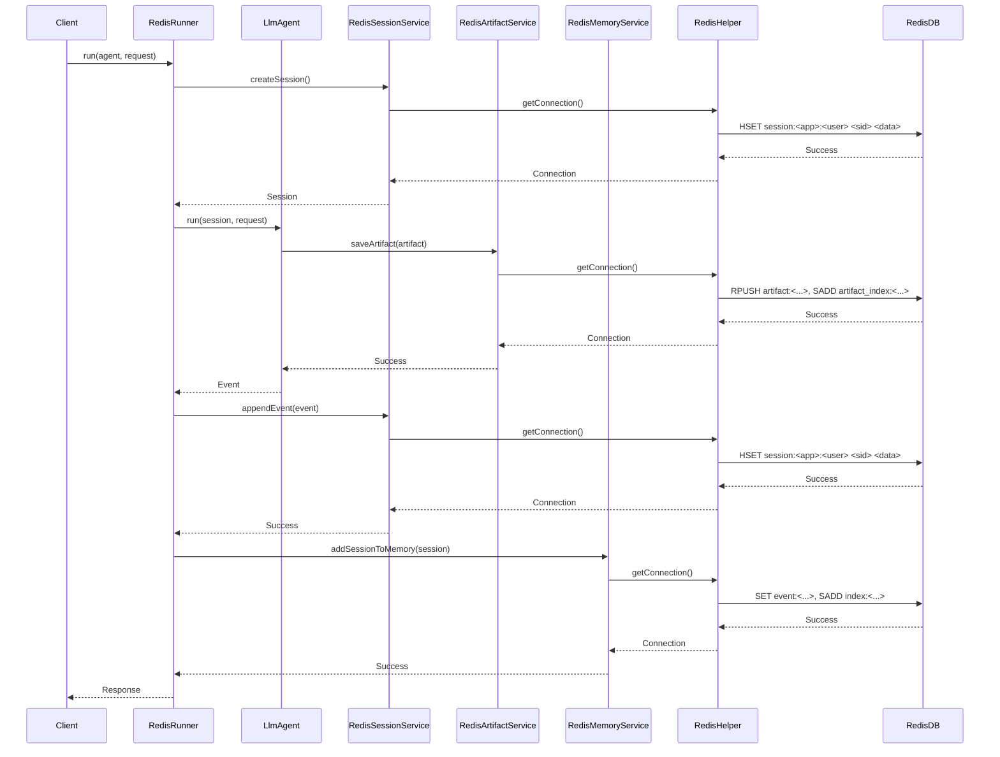

# Redis Implementation

**Author:** Sandeep Belgavi
**Date:** October 2, 2025

## Overview

This document outlines the Redis-backed implementation for core services within the Google Agent Development Kit (ADK). This implementation provides a fast, in-memory, persistent storage layer for sessions, artifacts, and memory using Redis. It is an alternative to the default in-memory or other database-backed services.

## Features Implemented

The following services have been implemented to use a Redis backend:

### 1. `RedisSessionService`
Located in `com.google.adk.sessions`, this service manages the lifecycle of agent sessions using Redis Hashes.

- **`createSession`**: Creates a new session and stores it in a Redis Hash specific to the user.
- **`getSession`**: Retrieves a specific session by its ID from the user's session Hash.
- **`listSessions`**: Lists all sessions for a given user by retrieving all values from the session Hash.
- **`deleteSession`**: Deletes a session from the user's session Hash.
- **`appendEvent`**: Appends a new event to a session's event list and updates the session object in the Redis Hash.

### 2. `RedisArtifactService`
Located in `com.google.adk.artifacts`, this service handles the storage and retrieval of artifacts using Redis Lists and Sets.

- **`saveArtifact`**: Saves a new artifact version to a Redis List and adds the filename to a Redis Set for easy lookup.
- **`loadArtifact`**: Loads a specific version of an artifact from the corresponding Redis List.
- **`listArtifactKeys`**: Lists the filenames of all artifacts for a session by reading from the Redis Set.
- **`deleteArtifact`**: Deletes the Redis List containing all versions of an artifact and removes its key from the index Set.
- **`listVersions`**: Returns a list of version numbers based on the length of the artifact's Redis List.

**Note on Binary Data:** To store binary files (e.g., images, audio), you should read the file into a `byte[]` and create a `Part` using `Part.fromData(bytes, mimeType)`. The service will automatically serialize the `Part` object, Base64 encoding the binary data into a string that is safe for storage in Redis.

### 3. `RedisMemoryService`
Located in `com.google.adk.memory`, this service provides keyword-based memory search using Redis Sets for indexing.

- **`addSessionToMemory`**: Stores each event as a separate key-value pair and creates an inverted index where each word maps to a Redis Set of event IDs.
- **`searchMemory`**: Uses the `SUNION` command to efficiently find the union of all event IDs matching the query's keywords and retrieves the corresponding events.

### 4. `RedisRunner`
Located in `com.google.adk.runner`, this runner class initializes and uses the Redis-backed services. It is configured to connect to a local Redis instance by default.

## Redis Data Structures

This implementation leverages several Redis data structures to efficiently store and retrieve agent data:

-   **Hashes**: Used by `RedisSessionService` to store all sessions for a given user. The hash key is `session:<appName>:<userId>`, and each field within the hash is a `sessionId` pointing to the serialized session data. User and app state are also stored in separate Hashes.
-   **Lists**: Used by `RedisArtifactService` to store versions of an artifact. The list key is `artifact:<appName>:<userId>:<sessionId>:<filename>`, and each element in the list is a serialized artifact `Part`.
-   **Sets**: Used by `RedisArtifactService` to keep a unique index of artifact filenames for a session (`artifact_index:<appName>:<userId>:<sessionId>`). Also used by `RedisMemoryService` to create an inverted index (`index:<appName>:<userId>:<word>`) mapping keywords to sets of event IDs.

## Sample Main Programs

The following are sample `main` methods that demonstrate how to use each of the new Redis-backed services.

**Note:** To run these examples, you will need to have a Redis instance running locally.

### `RedisSessionService` Example

```java
import com.google.adk.sessions.RedisSessionService;
import com.google.adk.sessions.Session;
import com.google.adk.store.RedisHelper;
import java.util.Optional;

public class RedisSessionServiceExample {
    public static void main(String[] args) {
        RedisHelper.initialize("redis://localhost:6379");
        RedisSessionService sessionService = new RedisSessionService();

        String appName = "myRedisApp";
        String userId = "user789";

        // Create a session
        Session createdSession = sessionService.createSession(appName, userId, null, null).blockingGet();
        System.out.println("Created session: " + createdSession.id());

        // Get the session
        Session retrievedSession = sessionService.getSession(appName, userId, createdSession.id(), Optional.empty()).blockingGet();
        System.out.println("Retrieved session: " + retrievedSession.id());

        RedisHelper.close();
    }
}
```

### `RedisArtifactService` Example

```java
import com.google.adk.artifacts.RedisArtifactService;
import com.google.adk.store.RedisHelper;
import com.google.genai.types.Part;
import java.nio.file.Files;
import java.nio.file.Paths;
import java.util.Optional;

public class RedisArtifactServiceExample {
    public static void main(String[] args) throws Exception {
        RedisHelper.initialize("redis://localhost:6379");
        RedisArtifactService artifactService = new RedisArtifactService();

        String appName = "myRedisApp";
        String userId = "user789";
        String sessionId = "session123";

        // Example with a text file
        String textFilename = "redis-greeting.txt";
        Part textArtifact = Part.fromText("Hello, from Redis!");
        Integer textVersion = artifactService.saveArtifact(appName, userId, sessionId, textFilename, textArtifact).blockingGet();
        System.out.println("Saved text artifact '" + textFilename + "' with version: " + textVersion);
        Part loadedTextArtifact = artifactService.loadArtifact(appName, userId, sessionId, textFilename, Optional.of(textVersion)).blockingGet();
        System.out.println("Loaded text artifact content: " + loadedTextArtifact.text().get());

        // Example with a binary file (e.g., an image)
        String binaryFilename = "my-redis-image.png";
        // Create a dummy file for the example
        Files.write(Paths.get(binaryFilename), new byte[]{1, 2, 3, 4, 5});
        byte[] binaryData = Files.readAllBytes(Paths.get(binaryFilename));
        Part binaryArtifact = Part.fromBytes(binaryData, "image/png");
        Integer binaryVersion = artifactService.saveArtifact(appName, userId, sessionId, binaryFilename, binaryArtifact).blockingGet();
        System.out.println("Saved binary artifact '" + binaryFilename + "' with version: " + binaryVersion);
        Part loadedBinaryArtifact = artifactService.loadArtifact(appName, userId, sessionId, binaryFilename, Optional.of(binaryVersion)).blockingGet();
        System.out.println("Loaded binary artifact content has " + loadedBinaryArtifact.inlineData().get().data().get().length + " bytes.");

        RedisHelper.close();
    }
}
```

### `RedisMemoryService` Example

```java
import com.google.adk.events.Event;
import com.google.adk.memory.RedisMemoryService;
import com.google.adk.memory.SearchMemoryResponse;
import com.google.adk.sessions.Session;
import com.google.adk.store.RedisHelper;
import com.google.genai.types.Content;
import com.google.genai.types.Part;
import java.util.List;

public class RedisMemoryServiceExample {
    public static void main(String[] args) {
        RedisHelper.initialize("redis://localhost:6379");
        RedisMemoryService memoryService = new RedisMemoryService();

        String appName = "myRedisApp";
        String userId = "user789";
        Session session = Session.builder("session456")
            .appName(appName)
            .userId(userId)
            .events(List.of(
                Event.builder()
                    .timestamp(1L)
                    .author("user")
                    .content(Content.builder().parts(List.of(Part.fromText("a memory from redis"))).build())
                    .build()
            ))
            .build();

        // Add a session to memory
        memoryService.addSessionToMemory(session).blockingAwait();
        System.out.println("Added session to memory.");

        // Search memory
        SearchMemoryResponse response = memoryService.searchMemory(appName, userId, "redis").blockingGet();
        System.out.println("Search results: " + response.memories());

        RedisHelper.close();
    }
}
```

## Architecture Overview

The Redis implementation provides a high-performance alternative to disk-based storage by leveraging an in-memory data structure store.

-   **RedisRunner**: Initializes the `RedisHelper` and injects the Redis-backed services into the agent runner.
-   **Redis Services**: Implement the business logic for sessions, artifacts, and memory using Redis commands via the Lettuce client.
-   **RedisHelper**: A singleton that manages the connection to the Redis server via a `RedisClient` and provides a shared `ObjectMapper` for JSON serialization.
-   **Lettuce**: A scalable, thread-safe Redis client for Java.
-   **Redis Database**: The in-memory database that stores all the data.

## Sequence Diagram

This diagram shows a typical agent run using the Redis-backed services.



## Running the Integration Tests

The integration tests for the Redis services use **Testcontainers** to run a real Redis instance in a Docker container.

### Docker Setup

Please ensure you have a working Docker environment. Instructions can be found in the `CASSANDRA_IMPLEMENTATION.md` document.

### Running the Tests

-   **Unit Tests (Default):** Run unit tests with the standard command.
    ```bash
    mvn clean install
    ```

-   **Integration Tests (Optional):** To run all integration tests (including Redis and Cassandra), activate the `integration-tests` profile:
    ```bash
    mvn clean install -Pintegration-tests
    ```
