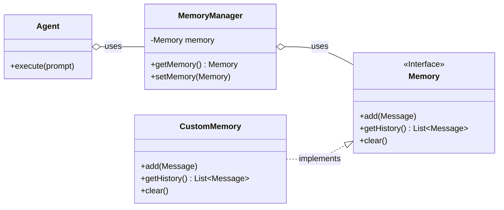
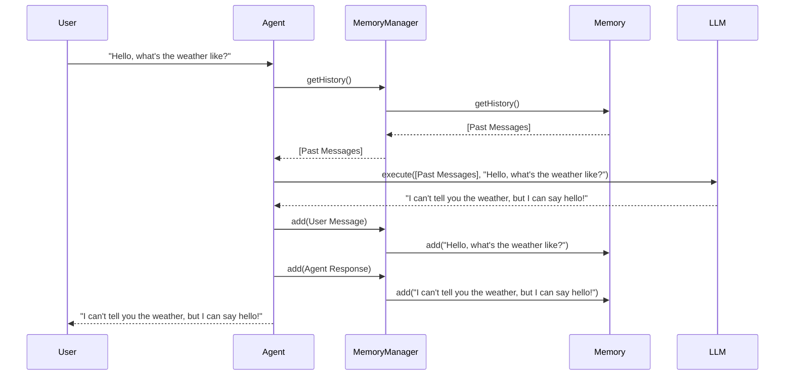

# Implementing and Using Memory in ADK

Memory allows your agent to retain information across conversations, enabling more context-aware and intelligent interactions. A robust memory implementation is crucial for building agents that can handle complex, multi-turn dialogues. This guide explains the core concepts of memory in the Agent Development Kit (ADK), how to create a custom memory store, and how to configure your agent to use it.

## Core Concepts

The ADK provides a flexible architecture for memory management centered around the `Memory` interface. This interface defines the contract that all memory stores must adhere to, allowing developers to provide their own implementations tailored to specific needs (e.g., in-memory for testing, Redis for production).

### Key Components

*   **`Memory` Interface:** The central piece of the memory architecture. It defines the essential methods for a memory store: `add` to save a message, `getHistory` to retrieve the conversation history, and `clear` to reset the memory.
*   **`MemoryManager`:** A controller that holds the `Memory` implementation and provides it to the agent during runtime. The agent interacts with the `MemoryManager` to access the memory store.
*   **Agent:** The agent uses the `MemoryManager` to retrieve history before executing a turn and to save the new messages after the turn is complete.

### Architecture Diagram

The following diagram illustrates the relationship between these core components. The agent depends on the `MemoryManager`, which in turn uses a concrete implementation of the `Memory` interface.



## How to Implement a Custom Memory Store

Creating a custom memory store allows you to control how and where conversation history is stored. You could implement a simple in-memory list, connect to a NoSQL database like Redis or Cassandra, or store conversations in a relational database.

To create your own memory store, you must implement the `com.google.cloud.ai.generative.agent.shared.Memory` interface.

### Step-by-Step Guide

1.  **Create a new Java class** that implements the `Memory` interface.
2.  **Implement the required methods:** `add`, `getHistory`, and `clear`.
3.  **Package your implementation** into a JAR file that can be included in your agent's classpath.

### Example: `InMemoryMemory.java`

Here is an example of a basic in-memory memory store. This implementation is useful for development and testing but is not suitable for production since the memory is volatile and will be lost when the application restarts.

```java
package com.example.memory;

import com.google.cloud.ai.generative.agent.shared.Memory;
import com.google.cloud.ai.generative.agent.shared.Message;
import java.util.ArrayList;
import java.util.Collections;
import java.util.List;
import java.util.concurrent.locks.ReentrantReadWriteLock;

/**
 * A simple in-memory implementation of the Memory interface.
 * This implementation is thread-safe.
 */
public class InMemoryMemory implements Memory {

    private final List<Message> messages = new ArrayList<>();
    private final ReentrantReadWriteLock lock = new ReentrantReadWriteLock();

    @Override
    public void add(Message message) {
        lock.writeLock().lock();
        try {
            messages.add(message);
        } finally {
            lock.writeLock().unlock();
        }
    }

    @Override
    public List<Message> getHistory() {
        lock.readLock().lock();
        try {
            return Collections.unmodifiableList(new ArrayList<>(messages));
        } finally {
            lock.readLock().unlock();
        }
    }

    @Override
    public void clear() {
        lock.writeLock().lock();
        try {
            messages.clear();
        } finally {
            lock.writeLock().unlock();
        }
    }
}
```

## Implemented Memory Stores

The ADK comes with a few pre-built memory implementations that you can use out of the box.

### `InMemoryMemory`

This is a basic in-memory store that is useful for development and testing. It is not recommended for production use, as the memory is volatile and will be lost when the application restarts.

### `CassandraMemoryService`

This is a persistent memory store that uses Apache Cassandra as a backend. It is suitable for production use and provides a scalable and robust solution for storing conversation history. For more details on how to configure and use the `CassandraMemoryService`, please refer to the [Cassandra Implementation Guide](./CASSANDRA_IMPLEMENTATION.md).

## How to Use Your Memory Implementation

After creating your custom memory implementation, you need to configure your agent to use it. This is typically done through the agent's configuration YAML file.

### Configuration via YAML

In your `root_agent.yaml` (or other agent configuration file), specify the fully qualified class name of your custom memory implementation under the `memory` key.

**Example `root_agent.yaml`:**

```yaml
# Agent Display Name
displayName: My Custom Agent

# Memory Configuration
# Specify the fully qualified path to your custom memory implementation.
memory: com.example.memory.InMemoryMemory

# LLM Configuration (example)
llm:
  gemini:
    model: gemini-1.5-flash
```

When the agent is loaded, the ADK framework will instantiate your `com.example.memory.InMemoryMemory` class and wire it into the `MemoryManager` for the agent to use.

## Agent Interaction Flow

The following sequence diagram shows how an agent interacts with the memory store during a typical conversation turn.



This flow ensures that the LLM always has the full context of the conversation, allowing it to generate more relevant and accurate responses. The agent is responsible for persisting both the user's prompt and its own response to the memory store for future turns.
